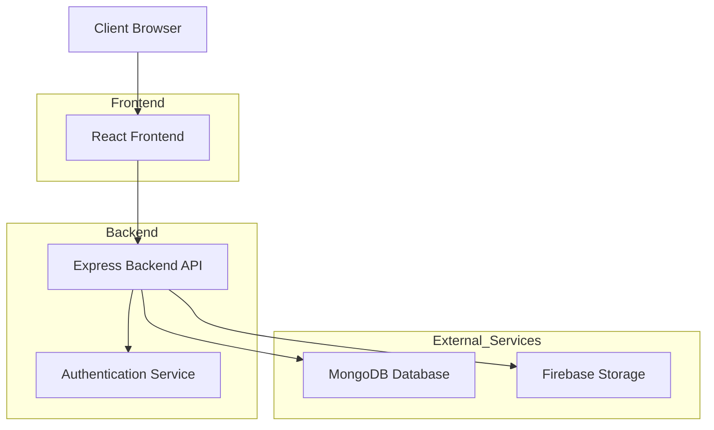
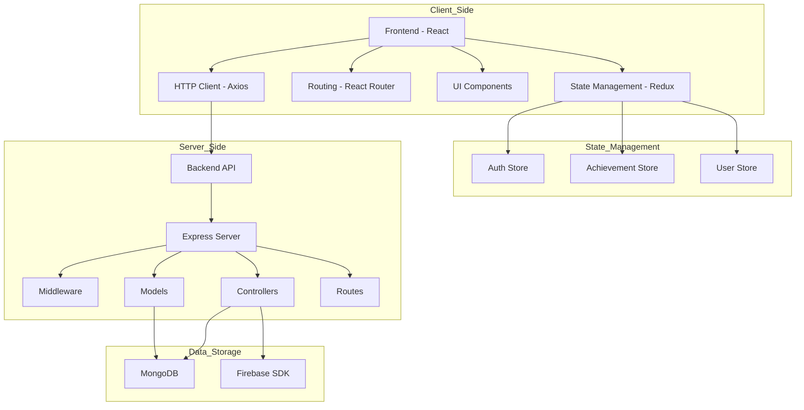
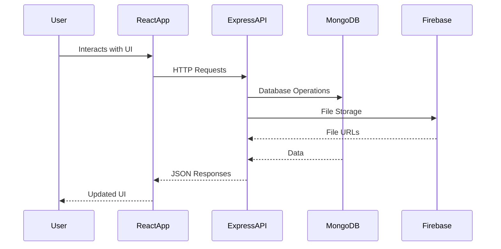

# System Architecture

## High-Level Architecture



## Component Diagram



## Data Flow



## Database Schema

### User Schema
```
User {
  _id: ObjectId
  name: String
  email: String (unique)
  password: String
  role: String (student/faculty/admin)
  department: String
  studentId: String (unique, optional)
  isActive: Boolean
  createdAt: Date
  updatedAt: Date
}
```

### Achievement Schema
```
Achievement {
  _id: ObjectId
  title: String
  description: String
  date: Date
  category: String (academic/sports/technical/cultural/other)
  level: String (college/university/state/national/international)
  student: ObjectId (ref: User)
  department: String
  proofDocument: String (URL)
  status: String (pending/approved/rejected)
  approvedBy: ObjectId (ref: User, optional)
  approvedAt: Date (optional)
  rejectionReason: String (optional)
  createdAt: Date
  updatedAt: Date
}
```

## API Endpoints Structure

```
/api
  /auth
    POST /register
    POST /login
    GET /profile
  /achievements
    POST /
    GET /my
    GET /
    PUT /:id/status
    GET /stats
  /users
    GET /
    GET /:id
    PUT /:id
```