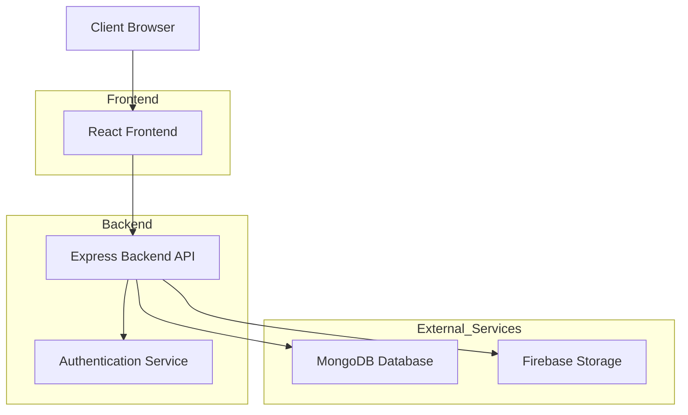
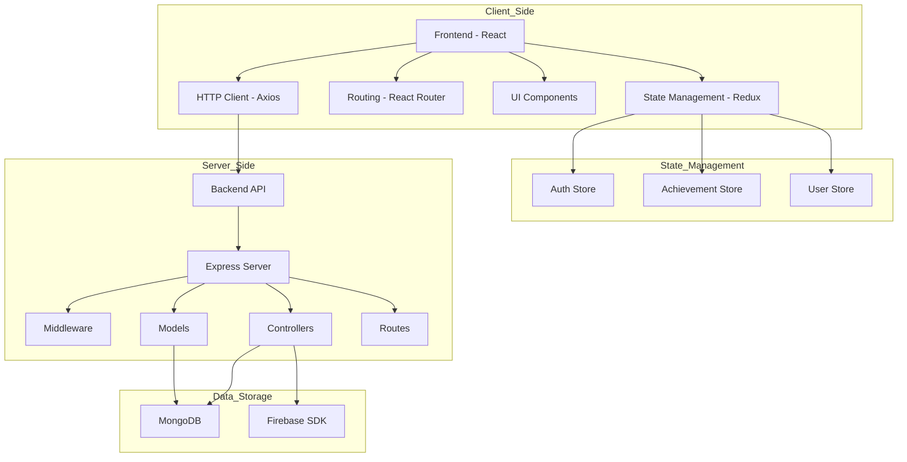

# SOFTWARE REQUIREMENTS SPECIFICATION (SRS) DOCUMENT

## PROJECT REPORT

---

## First Page

**COLLEGE LOGO**  
*(Place holder for college logo)*

**DEPARTMENT NAME**  
Computer Science and Engineering

### 1. Title of the Project
**Student Achievement Tracking & Showcase Portal**

### 2. Course Name
MERN Stack Development

### 3. Team Details
#### 4. Team Members with Registration Numbers
- Team Member 1 (Regd. No: XXXX)
- Team Member 2 (Regd. No: XXXX)
- Team Member 3 (Regd. No: XXXX)
- Team Member 4 (Regd. No: XXXX)

---

## Abstract

The Student Achievement Tracking & Showcase Portal is a comprehensive web application built with the MERN stack that allows students to record and track their achievements, which are then verified by faculty/admin for institutional record-keeping and recognition. The system provides a centralized platform for managing student accomplishments across academic, technical, sports, and cultural domains. It offers role-based dashboards for students, faculty, and administrators with features like achievement submission, verification workflow, analytics, and reporting. The application addresses the challenge of maintaining organized records of student achievements for colleges and universities while providing data-driven insights for institutional planning.

---

## 1. Introduction

### 1.1 Background
Educational institutions face significant challenges in systematically tracking and documenting student achievements across various domains. Traditional methods of maintaining physical records or scattered digital documents are inefficient and prone to data loss. The Student Achievement Tracking & Showcase Portal addresses these challenges by providing a centralized digital platform for recording, verifying, and showcasing student accomplishments.

### 1.2 Motivation
The motivation behind this project stems from the need to:
- Create a unified system for tracking student achievements
- Reduce administrative overhead in managing student records
- Provide data-driven insights for institutional decision-making
- Ensure compliance with accreditation requirements (NAAC/AICTE)
- Enhance student recognition and motivation through digital badges and points

### 1.3 Significance
This project is significant because it:
- Streamlines the achievement documentation process
- Improves data accuracy and accessibility
- Enables institutional analytics and reporting
- Supports student portfolio development
- Facilitates compliance with educational standards

---

## 2. Problem Statement

Educational institutions struggle with maintaining organized, accessible, and verifiable records of student achievements. The current manual processes involve:
- Scattered physical documents and certificates
- Inconsistent data formats across departments
- Time-consuming verification processes
- Difficulty in generating comprehensive reports
- Lack of centralized data for analytics
- Challenges in showcasing student accomplishments publicly

This leads to inefficiencies, data inaccuracies, and missed opportunities for recognizing student excellence.

---

## 3. Objectives

The primary objectives of the Student Achievement Tracking & Showcase Portal are:

1. **Centralized Achievement Management**: Create a unified platform for recording and managing student achievements across all domains.

2. **Verification Workflow**: Implement a streamlined process for faculty and admin verification of submitted achievements.

3. **Role-Based Access Control**: Provide tailored interfaces for students, faculty, and administrators with appropriate permissions.

4. **Analytics and Reporting**: Generate meaningful insights through data visualization and exportable reports.

5. **Data Security**: Ensure secure storage and transmission of sensitive student information.

6. **User-Friendly Interface**: Design an intuitive and responsive user interface for all stakeholders.

7. **Scalability**: Build a system that can accommodate growing user bases and data volumes.

---

## 4. System Requirements

### 4.1 Functional Requirements

#### Student Module
- User registration and authentication
- Achievement submission with details (title, date, level, proof, category)
- File upload for supporting documents or certificates
- View approval status and personal achievement timeline
- Dashboard with achievement statistics and badges

#### Faculty/Admin Module
- User management and role assignment
- Achievement verification and approval workflow
- View and manage pending submissions
- Generate department-wise and category-wise achievement analytics
- Export verified reports for institutional use

#### Public View (Optional)
- Showcase top achievements on college website
- Verify achievement certificates using QR codes

### 4.2 Non-Functional Requirements

#### Performance
- System response time should be less than 3 seconds for most operations
- Support concurrent users without performance degradation
- Efficient database queries and indexing

#### Security
- Secure authentication using JWT tokens
- Password encryption using bcrypt
- Role-based access control
- Protection against common web vulnerabilities (XSS, CSRF)

#### Usability
- Responsive design for desktop and mobile devices
- Intuitive user interface with clear navigation
- Accessibility compliance

#### Reliability
- 99.5% uptime
- Automatic error handling and recovery
- Data backup and recovery mechanisms

#### Scalability
- Horizontal scaling capabilities
- Support for increasing user base and data volume
- Cloud deployment ready

---

## 5. System Architecture

```
User → Frontend → Backend API → Database → Response
```

### High-Level Architecture



### Component Diagram



---

## 6. Methodology / Project Workflow

### 6.1 Development Methodology
The project follows an Agile development methodology with iterative development cycles.

### 6.2 System Workflow

1. **User Registration/Authentication**
   - Users register with their role (student/faculty/admin)
   - Login generates JWT token for session management
   - Token validation middleware for protected routes

2. **Achievement Submission**
   - Students fill detailed forms with achievement metadata
   - File upload capability for certificates/documents
   - Automatic department assignment based on user profile
   - Pending status until faculty/admin verification

3. **Verification Workflow**
   - Faculty/Admin view pending achievements
   - Review details and supporting documents
   - Approve or reject with reason
   - Notification system for status changes

4. **Analytics Dashboard**
   - Interactive charts for achievement distribution
   - Department-wise performance metrics
   - Category analysis (academic, sports, technical, etc.)
   - Export functionality for reports

5. **Data Management**
   - MongoDB for structured data storage
   - Firebase Storage for file uploads
   - Regular backups and maintenance

---

## 7. Modules Description

### 7.1 Authentication Module
- User registration with role-based access
- Secure login with JWT token generation
- Password reset functionality
- Session management

### 7.2 Student Module
- Achievement submission form
- File upload for certificates
- Personal dashboard with statistics
- Achievement timeline view
- Badge and points system

### 7.3 Faculty/Admin Module
- Achievement verification interface
- Approval/rejection workflow
- User management dashboard
- Analytics and reporting tools
- Export functionality

### 7.4 Notification Module
- Status change notifications
- Email/SMS alerts
- In-app notification system

### 7.5 Analytics Module
- Data visualization with charts
- Department-wise performance metrics
- Category analysis
- Trend analysis over time

### 7.6 Public Verification Module
- QR code generation for achievements
- Public certificate verification
- Achievement showcase gallery

---

## 8. Technology Stack

### 8.1 Frontend
- **React.js**: JavaScript library for building user interfaces
- **Redux**: State management library
- **React Router**: Navigation and routing
- **Recharts**: Data visualization library
- **Axios**: HTTP client for API requests

### 8.2 Backend
- **Node.js**: JavaScript runtime environment
- **Express.js**: Web application framework
- **MongoDB**: NoSQL database
- **Mongoose**: MongoDB object modeling tool
- **JWT**: JSON Web Tokens for authentication

### 8.3 Database
- **MongoDB**: Primary database for structured data
- **Firebase Storage**: File storage for certificates and documents

### 8.4 Development Tools
- **Visual Studio Code**: Code editor
- **Git**: Version control system
- **npm**: Package manager
- **Postman**: API testing tool

### 8.5 Deployment
- **Docker**: Containerization platform
- **Heroku/AWS**: Cloud hosting platforms
- **MongoDB Atlas**: Cloud database service

---

## 9. Screenshots of the Application

*(Note: Actual screenshots would be placed here in a real SRS document)*

### 9.1 Student Dashboard
The student dashboard provides an overview of personal achievements, statistics, and recent submissions.

### 9.2 Achievement Submission Form
A comprehensive form for students to submit their achievements with all relevant details.

### 9.3 Faculty Verification Interface
Dashboard for faculty members to review and verify student submissions.

### 9.4 Admin Analytics Dashboard
Comprehensive analytics and reporting interface for administrators.

### 9.5 Section-wise Data View
Detailed statistics and achievements for specific sections/cohorts.

---

## 10. APIs Used

### 10.1 Authentication APIs
- `POST /api/auth/register` - Register a new user
- `POST /api/auth/login` - Login user
- `GET /api/auth/profile` - Get user profile

### 10.2 Achievement APIs
- `POST /api/achievements` - Create new achievement
- `GET /api/achievements/my` - Get all achievements for logged-in student
- `GET /api/achievements` - Get all achievements (faculty/admin)
- `PUT /api/achievements/:id/status` - Update achievement status
- `GET /api/achievements/stats` - Get achievement statistics

### 10.3 User APIs
- `GET /api/users` - Get all users (admin)
- `GET /api/users/:id` - Get user by ID (admin)
- `PUT /api/users/:id` - Update user (admin)

### 10.4 Notification APIs
- `GET /api/notifications` - Get user notifications
- `PUT /api/notifications/:id/read` - Mark notification as read

### 10.5 Verification APIs
- `GET /api/verify/:qrCode` - Verify achievement by QR code

---

## 11. Testing

### 11.1 Unit Testing
- Backend API endpoints testing with Jest
- Frontend component testing with React Testing Library
- Database model validation

### 11.2 Integration Testing
- End-to-end workflow testing
- API integration testing
- Database connectivity testing

### 11.3 User Acceptance Testing
- Role-based functionality testing
- Usability testing
- Performance testing

### 11.4 Security Testing
- Authentication and authorization testing
- Input validation testing
- Vulnerability scanning

---

## 12. Deployment

### 12.1 Deployment Platforms
The application can be deployed on multiple platforms:

#### Heroku Deployment
1. Create a Heroku account and install the Heroku CLI
2. Create a new Heroku app
3. Set environment variables
4. Deploy the app using Git

#### AWS Deployment
1. Create an EC2 instance or use AWS Elastic Beanstalk
2. Install Node.js and MongoDB on the server
3. Clone the repository to the server
4. Install dependencies and build the frontend
5. Set environment variables and start the server

#### Docker Deployment
1. Build the Docker image
2. Run the container with appropriate environment variables

### 12.2 Environment Configuration
- NODE_ENV=production
- PORT=5000
- MONGODB_URI=your_mongodb_connection_string
- JWT_SECRET=your_jwt_secret_key

### 12.3 Database Configuration
- MongoDB Atlas for production database
- Firebase Storage for file uploads
- Regular backups and monitoring

---

## 13. Conclusion

The Student Achievement Tracking & Showcase Portal successfully addresses the critical need for educational institutions to maintain organized, accessible, and verifiable records of student achievements. By leveraging modern web technologies in the MERN stack, the system provides a robust, scalable, and user-friendly solution that benefits all stakeholders:

- **Students** gain a platform to document and showcase their accomplishments
- **Faculty** receive streamlined tools for verification and approval
- **Administrators** access comprehensive analytics and reporting capabilities
- **Institutions** achieve improved efficiency and compliance with accreditation standards

The system's modular architecture, role-based access control, and data-driven insights make it a valuable asset for educational institutions seeking to enhance their student achievement tracking processes.

---

## 14. Future Enhancements

### 14.1 Cloud Storage Integration
- Full implementation of Firebase Storage or AWS S3 for certificate uploads
- CDN integration for faster file delivery
- Automated file processing and optimization

### 14.2 Advanced Analytics
- Machine learning-based trend analysis
- Predictive analytics for achievement patterns
- Comparative performance metrics across departments

### 14.3 Mobile Application
- React Native mobile app development
- Push notifications for status updates
- Offline capability for form filling

### 14.4 Public Showcase
- Public-facing achievement gallery
- Social sharing features
- SEO optimization for discoverability

### 14.5 Enhanced Security
- Two-factor authentication
- Advanced encryption for sensitive data
- Audit trails for all system activities

### 14.6 Integration Capabilities
- API for third-party integrations
- LMS integration (Moodle, Canvas, etc.)
- Single Sign-On (SSO) support
